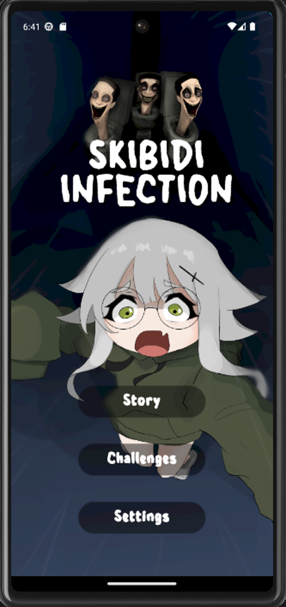
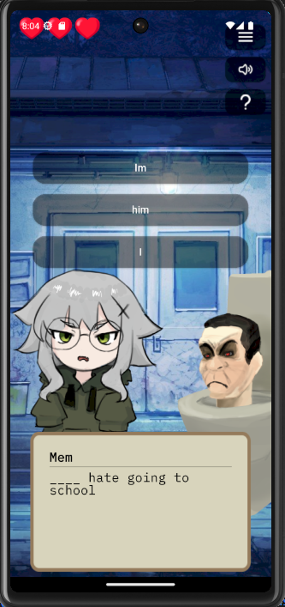
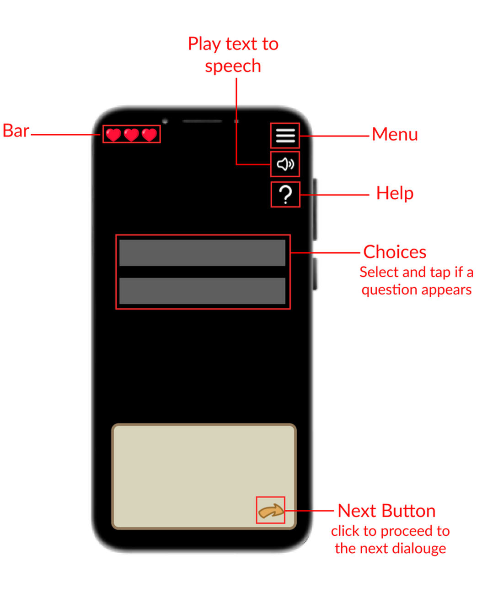

<div align="center">
  
</div>


## Description
This visual novel learning mobile game was created for educational purposes only. The application was developed using the Flutter framework. Its purpose is to help young users learn basic English grammar, science facts, and math equations.

## Screenshots
<div style="display: flex; gap: 10px;">
    
    
    
</div>


## Controls

 
 

## How to run

- Install Android Studio/Visual Studio Code
- Ensure that you had installed flutter sdk
- Ensure that you had installed dart
- Install any android emulator to your liking
- Run Skibidi Infection


## How to contribute
1. Clone this repository:
    ```bash
    git clone https://github.com/ImSauce/Skibidi-Infection
    ```
2. Make changes and test
3. Submit Pull Request with comprehensive description of changes
