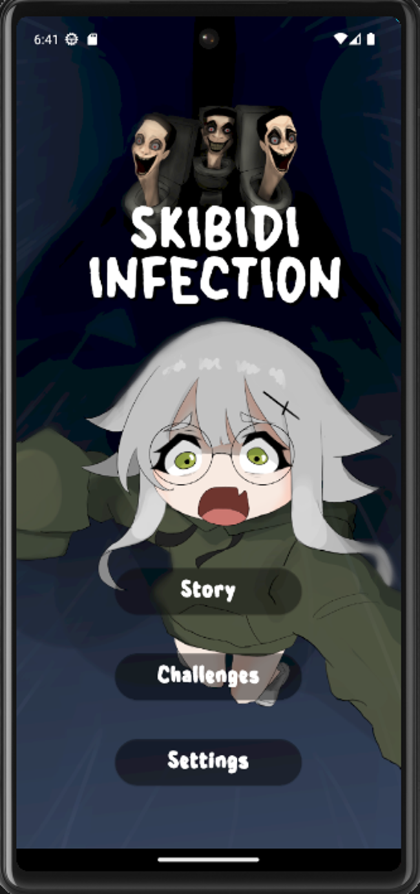
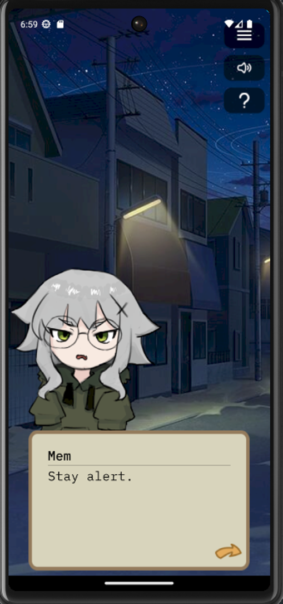
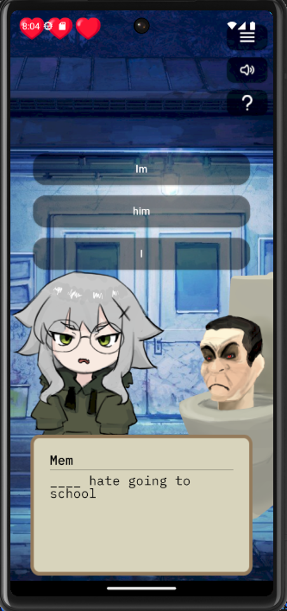
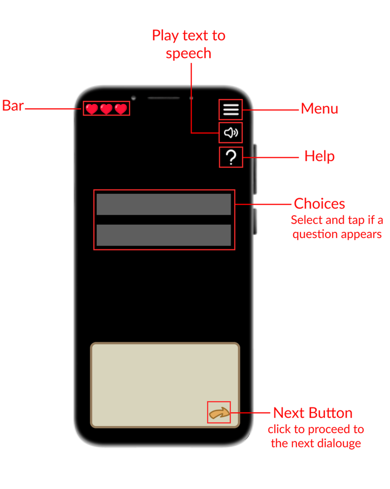

<div align="center">
  
</div>


## Description
This visual novel learning mobile game was created for educational purposes only. The application was developed using the Flutter framework. Its purpose is to help young users learn basic English grammar, science facts, and math equations while progressing through the game's story and interacting with the characters in the game. [Download](https://imsauce.github.io/Sauce/html/skibidi.html)


### Genre


## Screenshots
<div style="display: flex; gap: 10px;">
    
    
    
</div>


## Controls

 
 

## System Requirments
### Minimum: 
- **OS:** Android 10+ 
- **Processor:** Quad-core 1.8 GHz (Snapdragon 450 / Helio P22) 
- **Memory:** 3 GB RAM
- **Graphics:** Adreno 506 / Mali-G52 
- **Storage:** 300 MB 
- **Screen Resolution:** 720p minimum 


## How to contribute
1. Clone this repository:
    ```bash
    git clone https://github.com/ImSauce/Skibidi-Infection
    ```
2. Make changes and test
3. Submit Pull Request with comprehensive description of changes

## Acknowledgments
- Backgrounds from [Blue Archive Backgrounds](https://bluearchive.wiki/wiki/Category:Background_images)
- Sfx from [Blue Archive sfx](https://bluearchive.wiki/wiki/Category:Sound_effects)
- Character arts from [imsauce](https://x.com/imsauce_)
- Icons from [flaticons](https://www.flaticon.com/)
- BGM from [Blue archive OST](https://www.youtube.com/watch?v=SHkF48SgiSA&list=PLh6Ws4Fpphfqr7VL72Q6HK5Ole9YI54hv)
- Skibidi Toilet from [DaFuq!?Boom!](https://www.youtube.com/@DaFuqBoom)
