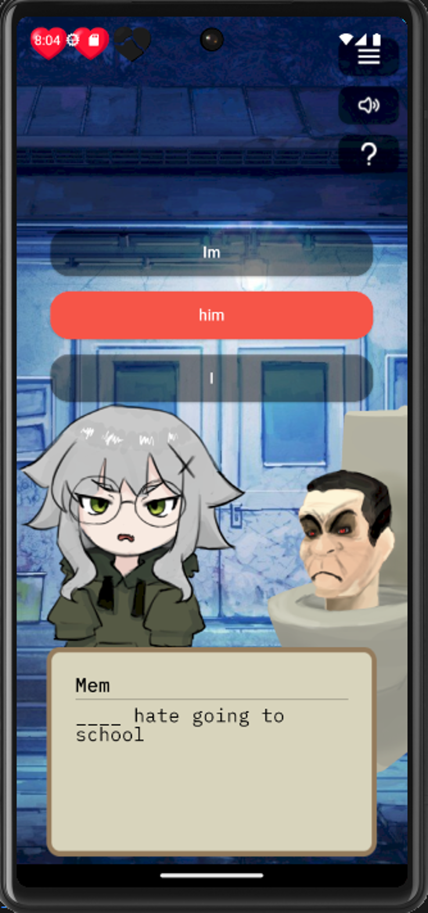

<div align="center">
  
</div>


## Description
This visual novel learning game was created using flutter that would help users learn basic english grammar, science facts, and math eqations.

## Screenshots
<div style="display: flex; gap: 10px;">
    
    
    
    
</div>
## Controls

 

## How to run

- Install Android Studio/Visual Studio Code
- Ensure that you had installed flutter sdk
- Ensure that you had installed dart
- Install any android emulator to your liking
- Run Skibidi Infection


## How to contribute
1. Clone this repository:
    ```bash
    git clone https://github.com/ImSauce/Skibidi-Infection
    ```
2. Make changes and test
3. Submit Pull Request with comprehensive description of changes
